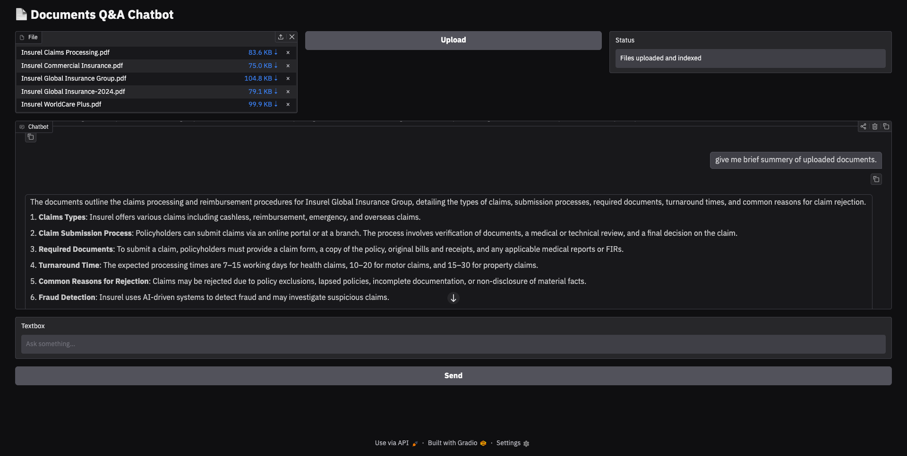

# 📄 Document Q&A Chatbot (RAG System) using LangChain & OpenAI

A secure Retrieval-Augmented Generation (RAG) chatbot that allows users to upload multiple PDF documents and ask questions based on their content. The system uses LangChain, OpenAI, FAISS, and Gradio to provide accurate, document-grounded answers with conversational memory.

## 📸 Demo Screenshot


## Tech Stack
- Python
- OpenAI (GPT-4o-mini)  
- Gradio
- LangChain
- OpenAI Embeddings
- FAISS

## Setup Instructions

### 1. Clone Repository
```bash
git clone https://github.com/MeghaRajpara/documents_rag_chatbot.git
cd documents_rag_chatbot
```

### 2. Create Virtual Environment
```bash
python -m venv venv
source venv/bin/activate    # Windows: venv\Scripts\activate
```

### 3. Install Dependencies
```bash
pip install -r requirements.txt
```

### 4. Configure Environment Variables
```bash
cp .env.example .env
```
Add your OpenAI API key to .env.

### 5. Run Application
```bash
python main.py
```

### 6. Open Browser
Gradio will start locally at:
```bash
http://127.0.0.1:7860
```
Or Your local URL

## 📌 Example Usage

1. Upload one or more PDF files
2. Click "Upload"
3. Ask questions such as:

```
What is the main topic of this document?
Who is the author?
What are the key findings?
```

4. Receive document-based answers